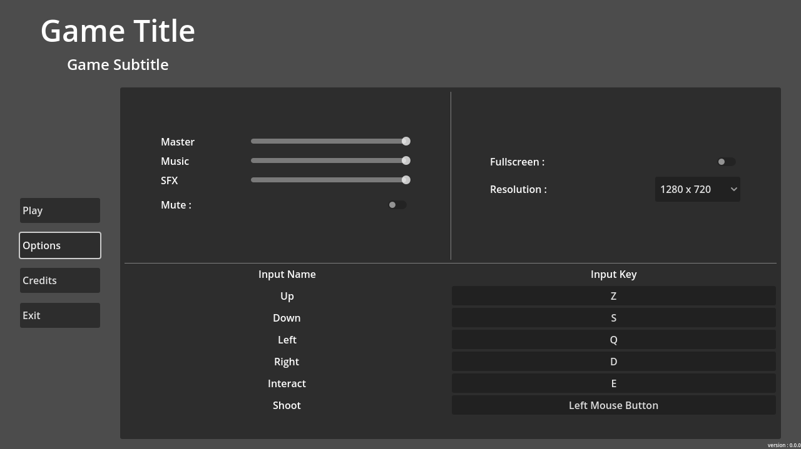

#  Rakugo Game Template


[](https://discord.gg/K9gvjdg)

Inspired by the [GGT](https://github.com/crystal-bit/godot-game-template/tree/main) of [Crystal-bit](https://github.com/crystal-bit) and the [GGT](https://github.com/Maaack/Godot-Game-Template) of [Maaack](https://github.com/Maaack/Godot-Game-Template). This [Godot](https://godotengine.org)'s project aiming to provide a way to make games easily.

## Feature
* **Main Menu** with Play, Options, Credits and Exit buttons
* **Options Menu** to set audio, resolutions, and inputs
* **Loading Screen** between each loads
* **Transitions** between each scenes
* **Game Template Scene** with a Pause Menu and a End Menu (Win/Loose)
* **Pause Menu** with Resume, Restart, Options, Main Menu, and Exit Buttons
* **End Menu** with Restart, Main Menu and Exit Buttons
* **Scene Loader** use it to load and change scene easily
* **UI Sounds Manager** handle the UI sounds in one place



[Installation](#installation) -
[What do you need to now](#what-do-you-need-to-know) -
[Info](#infos)
---

## Installation

### If you want to create a new project with it

1. Download the last [release]()
1. Unzip the archive
1. Import the project from the [Godot](https://godotengine.org) Project Manager

### If you have already a project

1. Download the last [release]()
1. Unzip the archive
1. Copy the addons/RakugoGameTemplate folder in your project folder
1. In the scenes folder, copy what you are interested in
1. Enable the plugin in the Project Settings (Plugins tab)
1. Reload the project
1. Eventualy set some values in the ProjectSettings (see bellow)

## What do you need to know

### Project Settings

In your Project Settings, enable "Advanced Settings". In Application/Addons/RakugoGameTemplate you can set some values.

* **Loading Scene Path** is the path to the Loading Scene of your project. It is used by the SceneLoader when you change scene
* **Main Menu Path** is the path to the Main Menu scene of your project. It is used when you return to the Main Menu from the Pause Menu
* **First Game Scene Path** is the path to the First Game Scene of your project. It is used when you click on the play button in the Main Menu

### Autoloads

When you enabled the plugin it will add some autoloads

* **SceneLoader** you can use it to load scene with the method *change_scene*(path_tscn:String, wait_after_load:bool = true). It will pause the tree, make a transition to the Loading Scene, before the end of the transition the tree is unpaused, then it load the wanted scene, after wait or not an action from the player, pause the tree again, a last transition to the desired scene and at the end after the transition is finished, unpause the tree.

```gd
const level_12 = "res://scenes/levels/level_12.tscn"
...
SceneLoader.change_scene(level_12)
```

* **Transitions** you can use it to make a transition with the method *transition*(transition_type, reverse:bool). transition_type are {Swipe,Square,Circle,Diamond,Line}. Transitions always works instead the tree is paused. It will not pause the tree for you, you should handle it.

```gd
get_tree().paused = true
Transitions.transition(Transitions.transition_type.Square)
await Transitions.animation_player.finished
get_tree().pause = false
```

* **UISoundManager** you do not need to call him, it will do the work for you. The only thing to do is to open "res://addons/rakugo_game_template/Autoloads/UISoundManager/UISoundManager.tscn" and parametrize the values of the main node *UISoundManager*. *Audio Bus* is the name of the audio bus the AudioStreamPlayer will use to play the "bip bip boup" of your UI. The next both values are Array. They will be use to take sound inside them randomly except if you add only just one. The first Array is for *pressed* sounds and the second *hovered* ones.

## Infos

If you want to help please write to us on our [Discord](https://discord.gg/K9gvjdg)

Rakugo Team website: https://rakugoteam.github.io/
